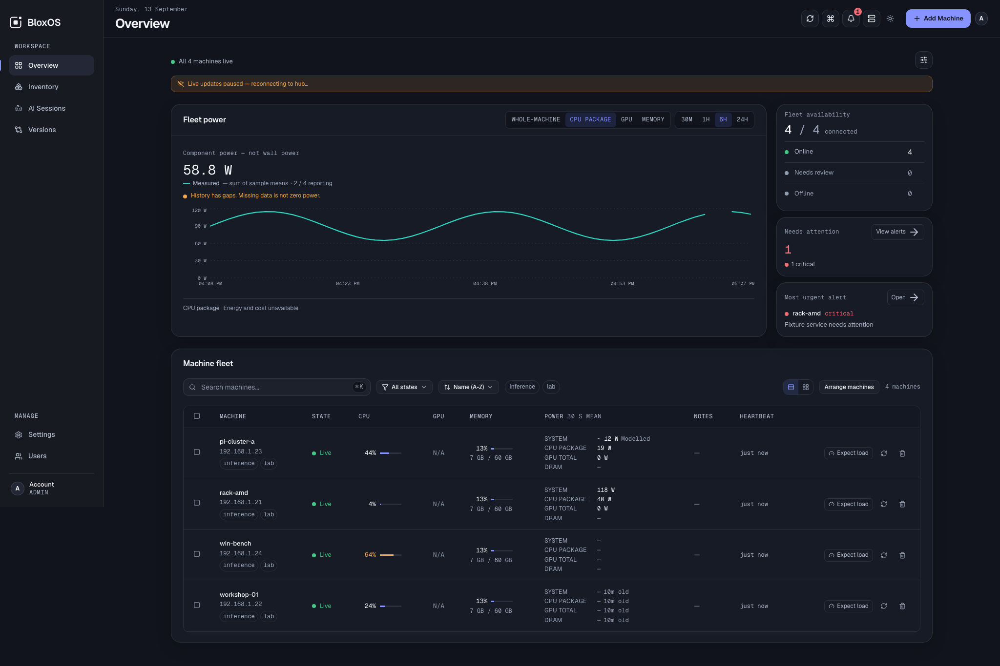

<div align="center">


# BloxOS

**Your machines. One clear view.**

Self-hosted fleet management for Linux servers, Windows workstations, and AI machines.<br>
See what is running, understand your hardware, and manage your fleet from one dashboard.

[](https://github.com/bokiko/bloxos/releases/latest)
[](https://github.com/bokiko/bloxos/actions/workflows/ci.yml)
[](LICENSE)

[Get started](#get-started) · [Dashboard gallery](docs/screenshots/README.md) · [Documentation](docs/README.md) · [Releases](https://github.com/bokiko/bloxos/releases) · [Report a bug](https://github.com/bokiko/bloxos/issues/new/choose)

</div>



*Lumen dashboard shipped in v1.7.3, shown with demo fixtures. These readings illustrate the interface; they are not live-fleet measurements.*

## One place to look. One place to act.

BloxOS brings the everyday work of running a homelab or small AI fleet together.
Host it on your own hardware, connect your machines, and open a browser.
No Kubernetes, Redis, or external database required.

| See your fleet | Operate it | Make it yours |
| --- | --- | --- |
| Live CPU, RAM, disk, GPU and freshness indicators | Linux web terminals with non-root shells and re-authentication | One dashboard design in your choice of two contrast modes |
| Hardware inventory with search, filters and exports | Machine actions, service and container controls where supported | Account profile with display name and avatar |
| Supported AI-tool session metadata across machines | Viewer, operator and admin permissions | Per-user preferences, pins and saved filters |
| 24-hour component power history with averages and sampled peaks | Native Linux and Windows agents with signed updates | Instance logo, favicon and welcome-message branding |

### One design. The whole app.

Every page uses the same responsive shell: a desktop navigation rail, mobile
navigation, and a top bar carrying the page title and global actions. Fleet overview,
machine details, inventory, AI Sessions, versions and settings all read the
same way.

Choose **Dark** (the default) or **Bright** appearance.
Change it from the toggle in the top bar, or in **Settings → Preferences**.
The choice is saved to your account, so it follows you to another browser.

[Design guide →](docs/themes/README.md) · [Screenshot gallery →](docs/screenshots/README.md)

### Machines stay where you put them

Name sorting no longer moves machines when connectivity changes. Choose
**Arrange machines**, drag or use the arrows, then **Save order**. Your **My
order** is saved per account and applies to both grid and list views. New machines
appear after your saved set. [Machine arrangement guide →](docs/machine-order.md)

### AI activity, without reading the conversation

AI Sessions reports supported running tools—Claude Code, Codex and Kimi—with
project basenames, explicitly detected model information, and inferred activity
states. Detection has limits; it is not a universal list of every local model.

It is **read-only metadata monitoring**: no prompts, responses, transcripts,
terminal output or full project paths. Administrators can disable it fleet-wide;
a machine can opt out with `BLOXOS_AI_SESSIONS=0`.

### Power readings you can interpret

Sensors are sampled on the machine at their supported cadence, collected into
30-second averages and sampled peaks, and retained in a rolling 24-hour history.
Unavailable readings stay unavailable; coverage and gaps are shown explicitly.

**Component power is not wall power.** CPU, DRAM and GPU readings do not include
every part of a machine or power-supply losses. Where a machine exposes a genuine
whole-system counter — a RAPL platform zone or an active in-band BMC reading — it is reported separately as `system` and labelled with the
backend that measured it. Machines with no counter report nothing; nothing is
estimated by current agents. Legacy modelled readings remain labelled Modelled
and separate from measurements. Domains are never added together; energy and
cost are withheld. [How power history works →](docs/power-history.md)

### Know what your agents are running

The **Versions** page shows the agent builds your hub offers for Linux x86-64,
Linux ARM64 and Windows x86-64, including missing platform binaries. It
distinguishes numbered releases, legacy unnumbered builds and unknown versions.
**Matches offered build** means a machine matches its hub's offered file—not
necessarily the newest BloxOS release. Older hubs without enough information
show an unknown status instead of guessing. [Version labels explained →](docs/versions.md)

An operator's **Pause rollout** is saved across hub restarts and changes to
served agent files. It stops new update announcements; it cannot cancel updates
already announced. [Rollout control →](docs/versions.md#rollout-control)

## Get started

This walkthrough installs a **new BloxOS server on Ubuntu 24.04 LTS** using
Docker. The server hosts your dashboard; later, you install a small **agent**
on each machine you want to monitor. You do not need to install Go, Node.js,
or a database yourself.

Already running BloxOS? Use [Update an existing installation](#update-an-existing-installation)
instead. These steps are not a reset or migration procedure.

### Before you start

Have these ready:

| Requirement | What you need |
| --- | --- |
| Server | A Linux computer or VM that stays on, with a 64-bit Intel/AMD (`amd64`) or ARM (`arm64`) processor. The commands below use Ubuntu 24.04. |
| Administrator access | A login on that server that can run `sudo`. |
| Network | Internet access to download the software. Your browser and managed machines must be able to reach the server. |
| Stable address | The server's local IP address or a hostname that resolves to it. Reserve its IP in your router so it does not change. |
| Available ports | TCP **80 and 443**, plus UDP **443**, must be free for the bundled proxy. Permit web access from your intended network. |
| Software | Docker Engine with the Compose plugin, Git, and Nano. Install/check them below. |
| Browser | A browser on your everyday computer, for creating your account and using BloxOS. |

This guide uses a local-network address; you do not need to buy a domain or
forward ports from the internet. Other Linux distributions can run the packaged
stack, but their software-installation commands differ.

### 1. Open a terminal on the server

Use the server's terminal directly, or connect to it over SSH from your own
computer. For example:

```sh
ssh your-user@192.168.1.50
```

Replace `your-user` with your server login and `192.168.1.50` with its address.
On Windows, you can enter this in PowerShell; on macOS or Linux, use Terminal.
**Run all installation commands below in this server terminal**, not on each
machine you plan to monitor. Run each command block in order; stop if one fails.

When `sudo` asks for a password, enter your server login password and press
Enter. It is normal for no characters to appear while you type it.

### 2. Install and check the required software

On the Ubuntu server, install Git (downloads BloxOS) and Nano (edits its settings):

```sh
sudo apt update
sudo apt install -y git nano ca-certificates curl
```

Check whether Docker and its Compose plugin already work:

```sh
sudo docker info
sudo docker compose version
```

The first command should show Docker server information without an error. The
second should print a Compose version. Use **`docker compose` with a space**,
not the older `docker-compose` command.

**If either command is missing:** follow Docker's official
[Ubuntu installation guide, “Install using the apt repository”](https://docs.docker.com/engine/install/ubuntu/#install-using-the-repository),
including its verification step, then return here and repeat both checks.
That procedure installs Docker Engine and the Compose plugin together.
If Docker is installed but reports that it cannot connect to the daemon, run
`sudo systemctl start docker` and check again. For another Linux distribution,
use its [Docker Engine installation instructions](https://docs.docker.com/engine/install/).

The commands in this walkthrough use `sudo docker`, so adding your account to
the Docker group is not required.

### 3. Find the server's address and check its ports

In the **server terminal**, run:

```sh
hostname -I
```

This prints the server's IP addresses. Use the local-network address that you
use to connect to this server—such as `192.168.1.50`. If several addresses appear,
check the server's entry in your router's connected-device list; do not simply
choose the first address or a Docker bridge address. If you connected over SSH
using a local IP, that is the address to use.

Check whether another service already occupies the web ports:

```sh
sudo ss -ltnp '( sport = :80 or sport = :443 )'
sudo ss -lunp 'sport = :443'
```

A heading with no rows underneath in both results means those TCP and UDP
ports are free. If rows appear, resolve that conflict before continuing; do not stop an
unrelated website just to make these steps work.

### 4. Download BloxOS

Run these commands in the server terminal:

```sh
cd ~
git clone --branch v1.7.5 --depth 1 https://github.com/bokiko/bloxos.git
cd ~/bloxos/docker
cp .env.example .env
```

This downloads release **v1.7.5**, enters its Docker folder, and makes your own
settings file, `.env`. A Git message about a “detached HEAD” is normal when
using a release tag. If a `bloxos` folder already exists, stop and check whether
it belongs to an existing installation; do not delete or overwrite it.

### 5. Enter your address and save the settings

Still in the server terminal, open the settings file with Nano:

```sh
nano .env
```

Use the arrow keys to find `HUB_HOST=hub.lan`. Replace that line with your
server's address. Then find the commented `# BLOXOS_VERSION=...` line, remove
its leading `#`, and set the version to `1.7.5`.

The two active settings should look like this, **with your own IP address**:

```dotenv
HUB_HOST=192.168.1.50
BLOXOS_VERSION=1.7.5
```

Keep `HUB_HOST` to just the IP or hostname: no `https://`, slash, or port number.
Do not use `localhost` or `127.0.0.1`; other computers would connect to themselves.
The version has **no leading `v`** here.

To save and close Nano:

1. Press **Ctrl+O** (hold Ctrl and press the letter O) to save.
2. Press **Enter** to keep the filename `.env`.
3. Press **Ctrl+X** to close the editor.

Check the settings you saved:

```sh
cat .env
sudo docker compose config --quiet
```

Confirm your address and `BLOXOS_VERSION=1.7.5` appear without a `#` before them.
The second command should finish without an error; no output means the Compose
configuration passed validation.

### 6. Download the images and start BloxOS

Run:

```sh
sudo docker compose pull
sudo docker compose up -d --no-build
sudo docker compose ps -a
```

The download may take a few minutes. In the status list, `hub`, `dashboard`,
and `caddy` should be running; wait for the hub and dashboard to become
`healthy`. `caddy-init` is a one-time setup task, so `Exited (0)` is expected
for that container.

If a service keeps restarting or becomes unhealthy, inspect its recent output:

```sh
sudo docker compose logs --tail=50 hub dashboard caddy
```

Resolve the error before continuing. Logs can contain setup information; do
not post them publicly without removing secrets.

### 7. Trust your server's certificate in your browser

The default installation creates its own HTTPS certificate authority. Your
browser will show a certificate warning until you trust it. In the **server
terminal**, copy its public certificate into your current folder:

```sh
sudo docker compose cp caddy:/data/caddy/pki/authorities/local/root.crt ./bloxos-root.crt
sudo chmod 644 ./bloxos-root.crt
```

The second command makes this local **public certificate copy** readable for
the download below; it does not change Caddy's stored files or private keys.

If your browser is on another computer, open a **second terminal on that
computer** and download the certificate over your trusted SSH connection:

```sh
scp your-user@192.168.1.50:~/bloxos/docker/bloxos-root.crt .
```

Replace the login and address with yours. This saves `bloxos-root.crt` in that
terminal's current folder. Import that certificate into the trusted certificate
store used by your browser. See the [browser trust steps](docker/README.md#browser-trust)
for Windows, macOS and Firefox. Obtain it from your own server, not from a
certificate-warning page. Copy only `bloxos-root.crt`, never private key files.

### 8. Open the dashboard and create your account

Back in the **server terminal**, display the first-boot setup token:

```sh
sudo docker compose exec hub cat /data/.bloxos/setup-token
```

Copy the token that appears. On your everyday computer, open your browser and
enter your address with `https://` in front—for example:

```text
https://192.168.1.50
```

Enter the setup token when prompted and follow the screen to create your admin
account. There is **no default username or password**. Keep the token private.
If the token is not ready, check that the hub is healthy and retry the command.

You should now see the dashboard. An empty fleet is normal: the next step adds
your first machine. You can close the server terminal; Docker keeps BloxOS running.

### 9. Keep the identity needed for automatic agent updates

On a fresh default installation, BloxOS creates and saves an **update signing
key** automatically. Agents installed through **Add Machine** receive its
public verification key. This lets them accept authorized agent updates after
you update the server; you do not need to create a key manually.

Keep the Docker data volumes and back them up using the
[backup and restore guide](docs/backup-restore.md). They contain your database,
login secrets, update signing key, and HTTPS identity. Losing the signing key
prevents existing agents from accepting future automatic updates. Do not run
`docker compose down -v` as an update or troubleshooting step: it deletes volumes.

For a custom public-certificate setup or existing offline signing arrangement,
use the [configuration guide](docs/configuration.md#tls-trust-for-onboarding).
The walkthrough above uses the default private CA and server-held signing key.

### 10. Enable the server's update button (optional)

Starting Docker does **not** install the separate host updater. To enable
**Settings → Updates** and `sudo bloxos-update update`, follow the
[one-time host-updater setup](docs/system-updates.md#enable-updates-on-an-older-installation)
on this server. It needs Python 3.10 or newer and systemd, detects your existing
installation, asks for confirmation, and also runs an update to the latest
stable release. Back up before running it.

You can instead use the [manual Compose update steps](#manual-compose-updates-without-the-host-updater).
Neither method schedules automatic server updates; you choose when to start one.

[More installation details and troubleshooting →](docker/README.md)

## Add your first machine

1. In the dashboard, choose **Add Machine**.
2. Select **Linux** or **Windows**, then copy the generated installation command.
3. On **that machine**, open a terminal with sudo access (Linux), or right-click
   PowerShell and choose **Run as administrator** (Windows).
4. Paste the generated command there and press Enter. On Linux, supply your
   sudo password if asked.
5. Return to the dashboard and wait for the machine to appear online. Open
   **Versions** to check its running agent build. Repeat with a fresh command
   for each machine you want to add.

Linux onboarding is **one copy-and-paste line**. Windows uses the generated
PowerShell command. The installer sets up the native service; the machine then
appears in your fleet. Enrollment links expire after 15 minutes—generate a new
one if needed, and do not share them publicly.

Linux agents support amd64 and arm64 with systemd; the packaged Windows agent
is amd64. Installation needs administrative privileges. The Linux service runs
as root and the Windows service as LocalSystem; Linux terminal sessions run as
a configured **non-root** user.

This command enrolls a machine into an existing hub. It does not install a
second hub. A public one-line *hub* installer is not shipped.

## Update an existing installation

With the host updater configured, update from your server terminal:

```sh
sudo bloxos-update update
```

Or use **Settings → Updates → Update BloxOS** as an administrator. Both use the
same independent host worker, with a backup, rollback and public verification
of the hub and dashboard. Any installation without the worker—including a
fresh Docker installation—needs the [one-time setup](docs/system-updates.md#enable-updates-on-an-older-installation).
Supports standard native systemd and local Compose deployments; it does not
silently switch between them.

### Manual Compose updates (without the host updater)

**Back up first.** Use the [backup and restore guide](docs/backup-restore.md),
which preserves the database, secrets, signing identity and Caddy CA. Never
use `docker compose down -v` to update.

**Identify the installation first.** The commands below update **Docker Compose
only**. If your website is served by native `bloxos-hub` / `bloxos-dashboard`
systemd services, pulling containers does not update those services. If both
exist, do not start another stack or switch the proxy: establish which existing
installation serves your public URL. See [upgrade verification](docs/verified-upgrades.md).

For an existing **Compose deployment**, open a terminal on the server and
enter the **existing** Compose directory. If you followed the walkthrough above:

```sh
cd ~/bloxos/docker
nano .env
```

Use your actual installation directory if it differs. Find `BLOXOS_VERSION`,
set it to `1.7.5`, then save with **Ctrl+O**, **Enter**, **Ctrl+X**. Keep your
existing `HUB_HOST`, project name and overrides. Run:

```sh
sudo docker compose config --quiet
sudo docker compose pull hub dashboard
sudo docker compose up -d --no-build hub dashboard
sudo docker compose ps
```

Container health alone does not prove the public website was upgraded. Verify
the hub **and dashboard** through the URL you actually use before declaring
success. Keep your existing volumes
and keys; normal upgrades do not require enrolling every machine again.

For new machines, generate a **fresh** Add Machine command after upgrading.
Commands expire after 15 minutes. Very old or customized deployments should
compare their Compose and Caddy configurations; pulling images does not update
bind-mounted configuration files. See the [Docker upgrade guide](docker/README.md#upgrades)
and [onboarding trust recovery](docs/configuration.md#tls-trust-for-onboarding).

The v1.7.5 packages carry agent release **9** for both native and Docker
installations, unchanged from v1.7.4. This maintenance release updates the hub
and dashboard; it does not introduce a new agent build. Updating a server does
not force a restart on agents already running the offered bytes.
Eligible agents update automatically in stages: one canary per
platform, followed by batches of two. An operator pause, missing signing
authorization, or a custom agent path can hold updates; check **Versions** for
the reason. A successful server update does not mean every agent has finished.
If the signing key pinned by existing agents has been lost, publishing a new
release cannot restore that trust. Use the [agent recovery guide](docs/agent-update-recovery.md)
for trusted recovery; do not remove signature checks or rollback protection.
[Agent delivery and overrides →](docs/native-agent-upgrades.md)

[Release notes](https://github.com/bokiko/bloxos/releases/tag/v1.7.5) ·
[Update signing](docs/offline-update-signing.md) ·
[Agent recovery](docs/agent-update-recovery.md)

## How it fits together

```text
Linux / Windows agents ── outbound WebSocket ── Go hub + SQLite
                                                    │
                                           Caddy HTTPS proxy
                                                    │
                                            Browser dashboard
```

Agents initiate the connection; managed machines need no inbound agent port.
The browser uses the hub API and an SSE stream. The Compose stack packages
Caddy, the hub, and the Next.js dashboard; agents remain native services.
API-polled integrations are also supported where an adapter is available.

[Architecture](docs/architecture.md) · [Configuration reference](docs/configuration.md) · [Source development](docs/development.md)

## Know the boundaries

- Web terminals are **Linux-only**. Only session metadata is audited, not terminal content.
- Hardware and sensor coverage depends on the OS, device and available drivers.
- AI Sessions is live metadata, not conversation playback, remote AI control, or session history.
- Power history covers 24 hours of component readings, not long-term observability or a wall-power meter.
- Signed updates and protocol-2 rollback protection are shipped; recovery differs between Linux and Windows.
- A full product-wide audit log, custom alert-rule editor, and public one-line hub installer are not shipped.

For current priorities, use the [issue tracker](https://github.com/bokiko/bloxos/issues).
[BLOXOS_FUTURE.md](BLOXOS_FUTURE.md) is a collection of longer-term ideas, not a
list of available features or a release commitment.

## Documentation and contributing

Start with the [documentation index](docs/README.md) for installation,
configuration, backups, power history, alerts, designs, and development.

Bug reports and focused pull requests are welcome. For larger changes, open an
issue describing the problem first. Read [CONTRIBUTING.md](CONTRIBUTING.md) and
the [Code of Conduct](CODE_OF_CONDUCT.md). Report vulnerabilities privately
using [SECURITY.md](SECURITY.md), not public issues.

## License and credits

[Apache License 2.0](LICENSE). Built by [Bokiko](https://bokiko.io).

This fleet-management project is unrelated to BotBlox's similarly named
Ethernet-switch firmware.
