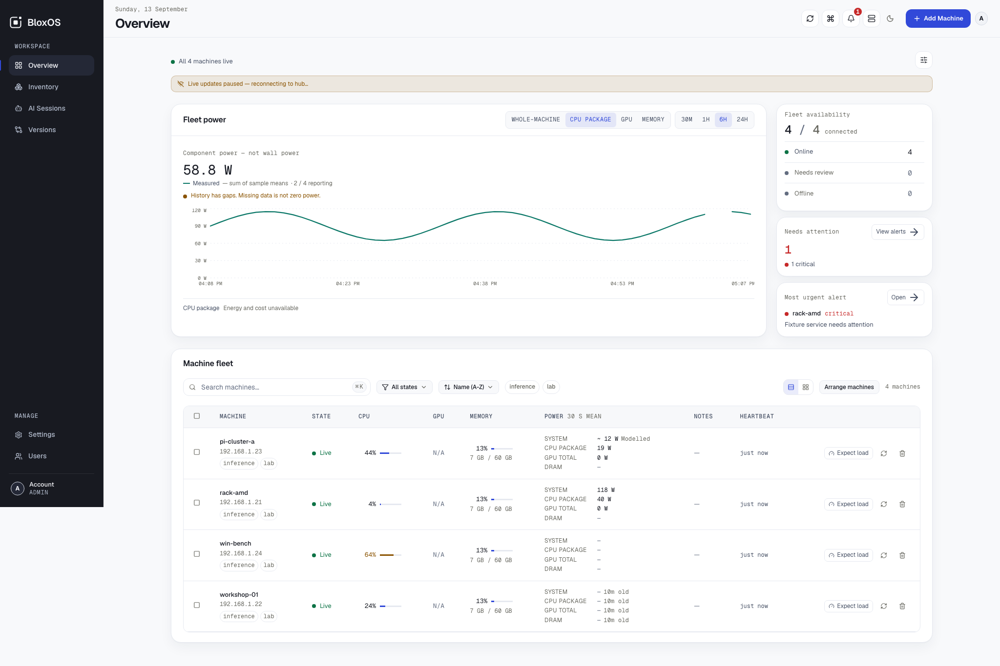
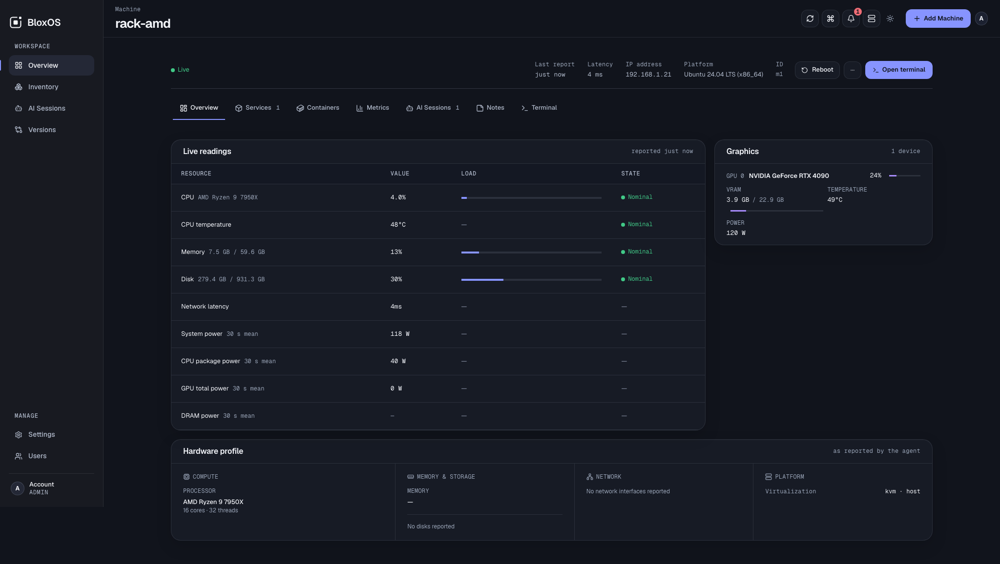
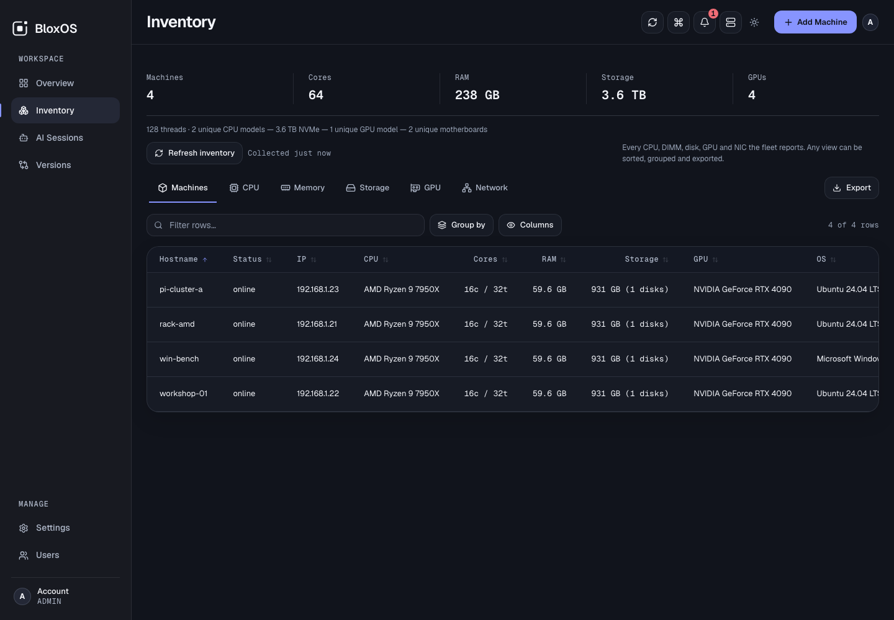
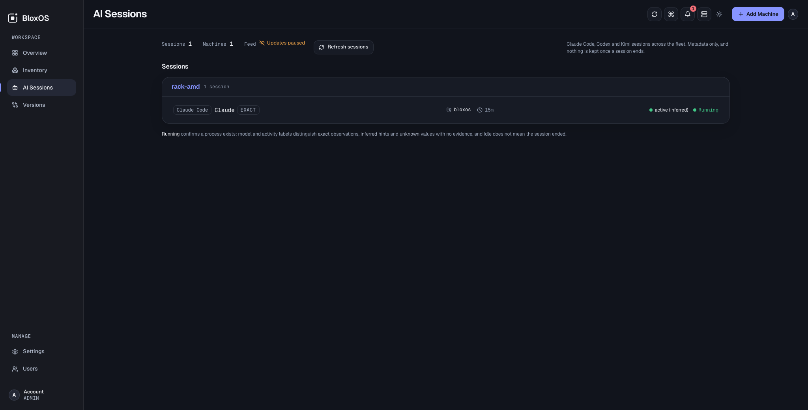
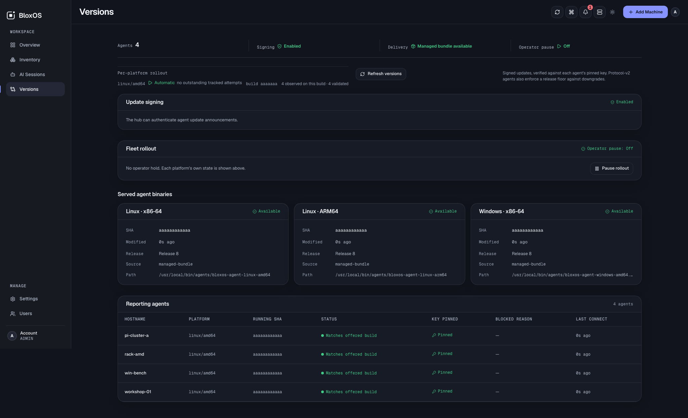

# Dashboard gallery

BloxOS v1.7.3 uses **Monoform with the Lumen visual finish**, in **Dark**
(default) or **Bright** appearance. These are browser captures of the release
candidate interface using demo fixtures, not live hardware measurements.
Modelled, stale, missing and failed states remain visible rather than being
replaced with invented measurements. The reconnect banner in the Overview
capture reflects the fixture environment's missing live stream.

## Overview — Dark

## Overview — Bright

## Machine Detail

## Inventory

## AI Sessions

## Versions

## Metric history states

Loading, request failure, confirmed empty history and a single-point response
have distinct presentations. [Final state captures](../reviews/lumen-visual-finish/pre-merge/README.md)
document those cases and their verification limits.

## Asset notes

- Captures live under `docs/reviews/lumen-visual-finish/`; they are unmodified
  browser screenshots. Fixture names and readings are illustrative.
- Earlier v1.1.0 images remain in this directory as historical assets. They do
  not depict the current application.
- The shared [logo SVGs](../../dashboard/public/brand/) are reused in the README.
- Future captures should use a disposable demo fleet, check for private data,
  and include both appearances. Never alter readings to hide unavailable sensors.

[Design guide](../themes/README.md) · [Back to BloxOS](../../README.md)
